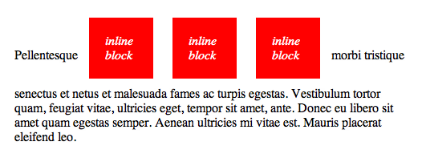

# Del 2 - Instagram

En liten tur innom DevTools på Instagram sine nettsider viser dette:

Passe ekstreme greier. Men slapp av, la oss se hva vi kan få til bare med litt kunnskap om boksmodellen og `block` vs `inline-block`.

## Del 1 - Skjemaet

Oppgavefilene ligger under `oppgavefiler/`. Åpne opp `index.html` i en nettleser. Som du ser er alle elementene i skjemaet på plass, men de har bare default styling (med unntak av `font-family`, som arves av `body`-selektoren).

### "Skisse"

Her er en flott designskisse med spesifikasjoner for skjemaet.

Du står fritt til å bare gå etter skissen, eller følge stegene under.

1. Sett bredden på skjemaet (`form`-elementet) til `350px` og bakgrunnsfargen til hvit. Det ligger allerede en selektor for dette elementet i `style.css`.
2. Sett bredden på logoen til `175px` og finn en måte å midtstille logoen på. Det er også lagt inn en selektor for dette elementet.
3. Lag en `h1`-selektor og juster ned fontstørrelsen litt, så teksten brekker slik skjermbildet viser.
4. Legg til en solid ramme – med verdiene indikert øverst til høyre i skissen – og `padding` på skjemaet.  
   Økte bredden på elementet? Hva kan du i så fall gjøre for å fikse dette?

Legg merke til at alle inputfeltene ligger på hver sin linje, med unntak av det passordfeltet. Bruk DevTools til å finne ut hvilken `display`-verdi som er default for `input`-elementer. Eller kanskje du klarer å gjette deg til det?

5. Lag en selektor for `input`-elementene, og se hva som skjer dersom du setter `width` til `49%`. Sett bredden til `100%`, slik at inputfeltene tar hele den tilgjengelige plassen.  
   **Bonus:** Hva skjer hvis du setter bredden til `50%`? Hva kan grunnen til dette være?
6. Fullfør stylingen ved å legge til resten av spesifikasjonene i skissen: `padding`, `border`, `margin`, `background` og `border-radius`. Eksperimenter litt med sistnevnte for å finne noe som ser passende ut.
7. Avstanden mellom siste inputfelt og "Sign up"-knappen er noe større enn mellom de andre inputfeltene. Bruk en pseudoselektor til å øke denne til `16px`.
8. Lag en `button`-selektor og legg på passende CSS. Er fonten kanskje litt liten (`font-size`) og tynn (`font-weight`)?
9. I den nederste paragrafen er det kun noen ord som er uthevet. Legg på inline-elementer rundt disse ordene, som gjør at de utheves.

## Del 2 - Resten av siden

Denne delen går ut på å legge inn bildet av mobilene, som ligger til venstre for skjemaet, samt å plassere både dette og skjemaet riktig på siden. Den mindre boksen med "Log in"-lenken, samt "Get the app."-teksten ser vi bort fra inntil videre.

1. Legg inn `instagram.png` med en `img`-tagg. Pass på at du legger det slik at du trenger å endre minst mulig på flyten i dokumentet. Lag en selektor for bildet og sett bredden på det til `350px`.

Bildet og skjemaet burde nå havne under hverandre på siden. Vi kan få dem til å havne ved siden av hverandre, ved å endre den standarde `display`-verdien til én av dem.

2. Bruk DevTools til å finne ut hvilket element du må endre `display`-verdien til.

Nå burde bildet og skjemaet ligge ved siden av hverandre, men de er kanskje justert litt merkelig horisontalt? Dette skyldes at et element med `display: inline-block` justeres slik at teksten inne i denne boksen havner på linje med teksten utenfor. Illustrasjonen under seksjonen om [inline block](https://css-tricks.com/almanac/properties/d/display/#inline-block) er muligens mer forklarende:

Fordi bildet kommer først, er det dette som bestemmer hva som er `baseline` i flyten. Fordi `img`-elementer ikke inneholder tekst, er det bunnen av `img`-boksen som setter `baseline`. Skjemaet plasseres derfor litt langt ned på siden, fordi den nederste teksten justeres etter bunnen av bildet. Du kan "verifisere" dette ved å prøve å legge på litt ekstra padding over og under den nederste paragrafen.

3. Bruk [`vertical-align`](https://css-tricks.com/almanac/properties/v/vertical-align/) propertien for å få toppen av skjemaet til å justere seg med toppen av bildet.

4. Bruk `padding-top` eller `margin-top` for å flytte bildet litt nedover på siden, slik at det ligner på skjermbildet øverst.

Det eneste som gjenstår da er å midtstille bildet og skjemaet. Det er en grunn til at midtstilling i CSS er "the poster child of CSS complaining", men horisonal midtstilling er betydelig enklere enn vertikal midtstilling (enn så lenge vi ikke bruker flexbox).

5. Prøv å midtstille de to elementene, og pass på at de får litt margin mellom seg. Spør hvis du står fast, eller bare vil ha et hint :blush:.

### Bonus 1 :rocket:

Legg til login-boksen under skjemaet og "Get the app"-teksten

### Bonus 2 :muscle:

Denne oppgaven går ut på å lage streken som ligger bak "OR". Det kan være lurt å ha sett litt på [posisjonering](https://css-tricks.com/almanac/properties/p/position/), dersom du ikke har gjort det allerede. I tillegg involverer denne oppgaven litt om hvordan man lager setter en gradient som bakgrunn.

1. Begynn med å sette en klasse på paragrafen som inneholder "OR", slik at den enkelt kan styles uten å påvirke andre paragrafer. Øk tykkelsen på teksten.
2. Legg en tom `` inn i paragrafen; vi skal bruke denne til å tegne streken.

For å plassere streken midt bak teksten må vi trikse litt med posisjonering.

3. Begynn med å sette `position: relative` på paragrafen og `position: absolute` på `span`-elementet. Dette vil ikke visuelt endre noe, men la oss inspisere `span`-elementet litt nærmere med DevTools.

Hvilke dimensjoner har det absolutt posisjonerte `span`-elementet? Hva skjer med disse dimensjonene hvis du "skrur" av `position: absolute` i inspektoren? Denne forskjellen skyldes at absolutt posisjonerte blir tatt ut av flyten. Derfor "arver" de ikke heller høyden til teksten rundt.

4. Sett høyden til `span`-elementet til `7px`, og gi det en sort bakgrunnsfarge. Dette er bare midlertidige verdier, så det blir litt lettere å se hvordan elementet oppfører seg.
5. Bruk det du kan om absolutt posisjonering inne i en relativ plassert container, til å gjøre `span`-elementet like bredt som paragrafen.
6. Nå bør du ha en strek, men den er plassert litt langt oppe. Dytt den litt ned ved å sette `top: 50%`. Dette gjør at toppen av streken legger seg midt på teksten. Enn så lenge linjen er såpass høy ser ikke dette helt riktig ut, så la oss justere den ned til `1px`.

> Et absolutt posisjonert elementet lar seg altså midtstille vertikalt innenfor containeren sin med `top: 50%`, men kun så lenge elementet er relativt "tynt" i forhold til høyden på containeren. For å faktisk midtstille det må man benytte et lite CSS-triks, som innebærer at man også legger på `transform: translateY(-50%)`. Jeg forklarer gjerne dette nærmere om du er interessert!

Det eneste som gjenstår nå er å style linjen, slik at den ikke går gjennom teksten.

7. Begynn med å endre bakgrunnen til `background: linear-gradient(to right, black, white)`. Dette setter bakgrunnsfargen til en lineær gradient. Det første argumentet definerer retningen på gradienten, mens de to neste definerer henholdsvis start- og sluttfarge.

Den lineære gradienten over kan også skrives som `background: linear-gradient(to right, black 0%, white 100%)`. Prosentverdiene her kalles _color-stop_-punkter. I vårt eksempel sier disse punktene at ved 0% skal det være helt sort, og ved 100% skal det være helt hvitt.

8. Endre den lineære gradienten til `linear-gradient(to right, black 35%, white 100%)`. Med dette sier vi at ved 35% skal det _fortsatt_ være helt sort. Den graderte overgangen til hvit begynner nå mye lengre til høyre.

En gradient kan ha uendelig mange farger, ikke bare to som i vårt tilfelle så langt.

9. Endre gradienten igjen, denne gangen til `linear-gradient(to right, black 0%, transparent 25%, transparent 75%, black 100%)`.

Vi nærmer oss noe nå, men vi ønsker jo ikke faktisk å ha en gradient der. Her går overgangen fra sort til gjennomsiktig mellom 0% og 25%, kan vi endre på _color-stop_-punktene slik at overgangen skjer umiddelbart?

10. Fullfør gradienten slik at det streken ligner på den i skjermbildet. Her er et par ressurser:  
    https://css-tricks.com/snippets/css/css-linear-gradient/  
    https://cssgradient.io/
