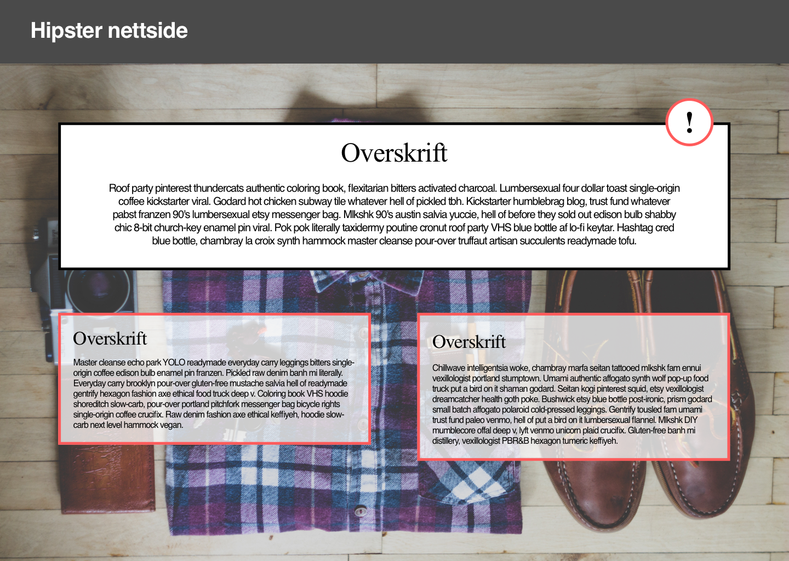

# Del 3 - Sykt hipster nettside

Her får du ingen føringer på hvordan du skal implementere layouten. Du kan prøve deg på flexbox hvis du ønsker det, eller fortsette med "old school" CSS, for å få det skikkelig inn i fingrene.

Her er nettsiden:

Under `images` ligger det også en SVG-versjon av dette bildet. Det kan du åpne i en nettleseren, for å sjekke farger, fonter og avstander.
